# Critical Path

Generated from the GitHub issue graph. Every item below is an issue in
[johnatorres226/foundations-of-programming-c](https://github.com/johnatorres226/foundations-of-programming-c/issues).

## Start here — unblocked now

| Issue | What | Who |
|---|---|---|
| [#1](https://github.com/johnatorres226/foundations-of-programming-c/issues/1) | TDD harness — tests run against exercises and solutions | Sonnet |
| [#2](https://github.com/johnatorres226/foundations-of-programming-c/issues/2) | Git workflow for parallel delivery | **you** |
| [#3](https://github.com/johnatorres226/foundations-of-programming-c/issues/3) | Exam template | Sonnet |

## The critical path

1. [#1](https://github.com/johnatorres226/foundations-of-programming-c/issues/1) harness and [#2](https://github.com/johnatorres226/foundations-of-programming-c/issues/2) git workflow — in parallel
2. The vertical slice — chapters 0.1–0.4 and 1.1, in parallel
3. [#25](https://github.com/johnatorres226/foundations-of-programming-c/issues/25) **vertical slice review (you)** — template and PRD fixes land here, before replication
4. The other 60 chapters — **all in parallel**; no chapter blocks another
5. Each module's project and exam (Modules 1–14), once its chapters close (needs [#4](https://github.com/johnatorres226/foundations-of-programming-c/issues/4) and [#3](https://github.com/johnatorres226/foundations-of-programming-c/issues/3))
6. [#114](https://github.com/johnatorres226/foundations-of-programming-c/issues/114) capstone, once Modules 1–14 are done

**Why chapters don't block each other:** every Recap is written against the outcomes
declared in `SYLLABUS.md`, not against the previous chapter's prose (PRD §3). Keep it that
way — it is the only reason step 4 can run in parallel.

## Graph

Exam template [#3](https://github.com/johnatorres226/foundations-of-programming-c/issues/3) feeds every module's exam; omitted from the graph for legibility.

```mermaid
flowchart TD
  F1["1 · TDD harness"]
  F2["2 · Git workflow (you)"]
  F4["4 · Project template"]
  G{"25 · Vertical slice review (you)"}
  CAP["114 · Capstone"]
  F1 --> F4
  F4 --> CAP
  M0_1["20 · 0.1 What a Program Actually Is"]
  F2 --> M0_1
  M0_1 --> G
  M0_2["21 · 0.2 The Story of C"]
  F2 --> M0_2
  M0_2 --> G
  M0_3["22 · 0.3 The Versions of C"]
  F2 --> M0_3
  M0_3 --> G
  M0_4["23 · 0.4 Set Up Your Machine"]
  F2 --> M0_4
  M0_4 --> G
  M1_1["24 · 1.1 Your First Program, Line by Line"]
  F2 --> M1_1
  M1_1 --> G
  F1 --> M1_1
  M1_1 --> PX1
  PX1["M1 project 86 + exam 87"]
  C1["M1 · 4 chapters · 26–29"]
  G --> C1
  C1 --> PX1
  PX1 --> CAP
  PX2["M2 project 88 + exam 89"]
  C2["M2 · 4 chapters · 30–33"]
  G --> C2
  C2 --> PX2
  PX2 --> CAP
  PX3["M3 project 90 + exam 91"]
  C3["M3 · 4 chapters · 34–37"]
  G --> C3
  C3 --> PX3
  PX3 --> CAP
  PX4["M4 project 92 + exam 93"]
  C4["M4 · 5 chapters · 38–42"]
  G --> C4
  C4 --> PX4
  PX4 --> CAP
  PX5["M5 project 94 + exam 95"]
  C5["M5 · 5 chapters · 43–47"]
  G --> C5
  C5 --> PX5
  PX5 --> CAP
  PX6["M6 project 96 + exam 97"]
  C6["M6 · 4 chapters · 48–51"]
  G --> C6
  C6 --> PX6
  PX6 --> CAP
  PX7["M7 project 98 + exam 99"]
  C7["M7 · 4 chapters · 52–55"]
  G --> C7
  C7 --> PX7
  PX7 --> CAP
  PX8["M8 project 100 + exam 101"]
  C8["M8 · 4 chapters · 56–59"]
  G --> C8
  C8 --> PX8
  PX8 --> CAP
  PX9["M9 project 102 + exam 103"]
  C9["M9 · 4 chapters · 60–63"]
  G --> C9
  C9 --> PX9
  PX9 --> CAP
  PX10["M10 project 104 + exam 105"]
  C10["M10 · 5 chapters · 64–68"]
  G --> C10
  C10 --> PX10
  PX10 --> CAP
  PX11["M11 project 106 + exam 107"]
  C11["M11 · 4 chapters · 69–72"]
  G --> C11
  C11 --> PX11
  PX11 --> CAP
  PX12["M12 project 108 + exam 109"]
  C12["M12 · 4 chapters · 73–76"]
  G --> C12
  C12 --> PX12
  PX12 --> CAP
  PX13["M13 project 110 + exam 111"]
  C13["M13 · 4 chapters · 77–80"]
  G --> C13
  C13 --> PX13
  PX13 --> CAP
  PX14["M14 project 112 + exam 113"]
  C14["M14 · 5 chapters · 81–85"]
  G --> C14
  C14 --> PX14
  PX14 --> CAP
```

## Modules

| Module | Epic | Chapters | Project | Exam |
|---|---|---|---|---|
| 0 · What Is C? | [#5](https://github.com/johnatorres226/foundations-of-programming-c/issues/5) | #20–#23 | — | — |
| 1 · Basics | [#6](https://github.com/johnatorres226/foundations-of-programming-c/issues/6) | #24–#29 | [#86](https://github.com/johnatorres226/foundations-of-programming-c/issues/86) | [#87](https://github.com/johnatorres226/foundations-of-programming-c/issues/87) |
| 2 · Control Flow | [#7](https://github.com/johnatorres226/foundations-of-programming-c/issues/7) | #30–#33 | [#88](https://github.com/johnatorres226/foundations-of-programming-c/issues/88) | [#89](https://github.com/johnatorres226/foundations-of-programming-c/issues/89) |
| 3 · Functions & Scope | [#8](https://github.com/johnatorres226/foundations-of-programming-c/issues/8) | #34–#37 | [#90](https://github.com/johnatorres226/foundations-of-programming-c/issues/90) | [#91](https://github.com/johnatorres226/foundations-of-programming-c/issues/91) |
| 4 · Arrays & Strings | [#9](https://github.com/johnatorres226/foundations-of-programming-c/issues/9) | #38–#42 | [#92](https://github.com/johnatorres226/foundations-of-programming-c/issues/92) | [#93](https://github.com/johnatorres226/foundations-of-programming-c/issues/93) |
| 5 · Pointers | [#10](https://github.com/johnatorres226/foundations-of-programming-c/issues/10) | #43–#47 | [#94](https://github.com/johnatorres226/foundations-of-programming-c/issues/94) | [#95](https://github.com/johnatorres226/foundations-of-programming-c/issues/95) |
| 6 · Structs, Enums, Unions | [#11](https://github.com/johnatorres226/foundations-of-programming-c/issues/11) | #48–#51 | [#96](https://github.com/johnatorres226/foundations-of-programming-c/issues/96) | [#97](https://github.com/johnatorres226/foundations-of-programming-c/issues/97) |
| 7 · Dynamic Memory | [#12](https://github.com/johnatorres226/foundations-of-programming-c/issues/12) | #52–#55 | [#98](https://github.com/johnatorres226/foundations-of-programming-c/issues/98) | [#99](https://github.com/johnatorres226/foundations-of-programming-c/issues/99) |
| 8 · Memory Deep Dive | [#13](https://github.com/johnatorres226/foundations-of-programming-c/issues/13) | #56–#59 | [#100](https://github.com/johnatorres226/foundations-of-programming-c/issues/100) | [#101](https://github.com/johnatorres226/foundations-of-programming-c/issues/101) |
| 9 · Files & I/O | [#14](https://github.com/johnatorres226/foundations-of-programming-c/issues/14) | #60–#63 | [#102](https://github.com/johnatorres226/foundations-of-programming-c/issues/102) | [#103](https://github.com/johnatorres226/foundations-of-programming-c/issues/103) |
| 10 · Multi-File Projects | [#15](https://github.com/johnatorres226/foundations-of-programming-c/issues/15) | #64–#68 | [#104](https://github.com/johnatorres226/foundations-of-programming-c/issues/104) | [#105](https://github.com/johnatorres226/foundations-of-programming-c/issues/105) |
| 11 · Debugging & Tooling | [#16](https://github.com/johnatorres226/foundations-of-programming-c/issues/16) | #69–#72 | [#106](https://github.com/johnatorres226/foundations-of-programming-c/issues/106) | [#107](https://github.com/johnatorres226/foundations-of-programming-c/issues/107) |
| 12 · Concurrency I | [#17](https://github.com/johnatorres226/foundations-of-programming-c/issues/17) | #73–#76 | [#108](https://github.com/johnatorres226/foundations-of-programming-c/issues/108) | [#109](https://github.com/johnatorres226/foundations-of-programming-c/issues/109) |
| 13 · Concurrency II | [#18](https://github.com/johnatorres226/foundations-of-programming-c/issues/18) | #77–#80 | [#110](https://github.com/johnatorres226/foundations-of-programming-c/issues/110) | [#111](https://github.com/johnatorres226/foundations-of-programming-c/issues/111) |
| 14 · Advanced | [#19](https://github.com/johnatorres226/foundations-of-programming-c/issues/19) | #81–#85 | [#112](https://github.com/johnatorres226/foundations-of-programming-c/issues/112) | [#113](https://github.com/johnatorres226/foundations-of-programming-c/issues/113) |
